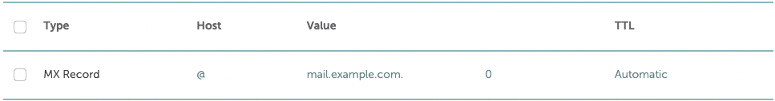
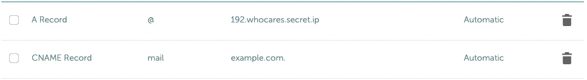

# docker-mailserver

[![ci::status]][ci::github] [![docker::pulls]][docker::hub] 

[ci::status]: https://img.shields.io/github/workflow/status/kristijorgji/docker-mailserver/Publish?color=blue&label=CI&logo=github&logoColor=white&style=for-the-badge
[ci::github]: https://github.com/kristijorgji/docker-mailserver/actions
[docker::pulls]: https://img.shields.io/docker/pulls/kristijorgji/docker-mailserver.svg?style=for-the-badge&logo=docker&logoColor=white
[docker::hub]: https://hub.docker.com/r/kristijorgji/docker-mailserver/

1. [About](#about)
2. [Requirements](#requirements)
3. [How to use](#how-to-use)
4. [How to update domains and users on fly](#how-to-update-domains-and-users-on-the-fly)
5. [How to connect via a mail client (Thunderbird)](docs/thunderbird/how-to-connect-with-thunderbird.md)
6. [How to develop locally](#how-to-develop-locally)
7. [How to test and troubleshoot the setup](docs/how-to-test-and-troubleshot-the-setup.md)

# About

A docker image that will provide an out of the box mailserver using

* postfix
* dovecot
* IMAP and POP with mysql driver so you can use mail clients like Thunderbird with ease
* Multiple domains supported, you can have send or receive emails coming for both me@example.com and me@whatever.com
* roundcube UI to send and check the received emails [WIP] 

# Requirements

**Tools**
- [Docker](https://www.docker.com/) installed
- [Docker compose](https://docs.docker.com/compose/) installed

**Prerequisites** 
- Your **mx record** points to the machine where you will use this docker mailserver will run
  - 
- Your _mailserver domain_ **A record (or cname)** points to the machine where  this docker mailserver will run.
  - 
- Your webserver is configured to listen for your _mailserver domain_ port 80, so letsencrypt can generate and renew the ssl certificate
- You need to expose the ports that you will use through your security group or firewall. Port 465 and 143 must be available, the rest are optional only if you use them
  - 25     # smtp
  - 465    # smtps
  - 110    # pop3
  - 143    # imap
  - 993    # imaps
  - 995    # pop3s

**System requirements**

**Recommended**:

- 1 Core
- 2GB RAM
- Swap enabled for the container

**Minimum**:

- 1 vCore
- 512MB RAM
- You'll need to deactivate some services like ClamAV to be able to run on a host with 512MB of RAM. Even with 1G RAM you may run into problems without swap

# How to use

First execute the following command to download and install the tool.
You can change `docker-mailserver` in the third line with whatever path you want for the install

```shell
curl -LJO https://raw.githubusercontent.com/kristijorgji/docker-mailserver/main/install.sh \
 && chmod a+x install.sh \
 && ./install.sh docker-mailserver
```

After the installation you will see a message of what configurations you can make before starting the docker container of the mailserver

You can modify those variables to your wishes, those involve things like
* your mailserver domain name
* your mailserver supported domains (can have more than one)
* your mailserver users
* etc

If you want to make more changes to the configurations of postfix/dovecot or any tool, just modify the `jinja2` templates at configs folder after the tool installs the mailserver.


Everything else is auto-generated during the start of the container including the self signed ssl certificates with the domain name provided
The provisioning is done via ansible and jinja2 templates, that is why the configuration templates end in `.j2` extension

# How to update domains and users on the fly

First change the configuration at `configs/vars/vault.yml` which contains your email accounts and domains.

Afterward from the root of this project run
```shell
./update.sh
```

That is all.

# How to develop locally

Run `make ress` to create a docker image and log into one container created from the created image

Afterward you can execute the boot provisioning by going to 
`cd /dev-docker-data`

then `bash entrypoint.sh`

Or if you want only to execute the ansible provisioning, can do:
```shell
cd /dev-docker-data/ansible
ansible-playbook playbook.yml
```

# [How to test and troubleshoot the setup](docs/how-to-test-and-troubleshot-the-setup.md)
