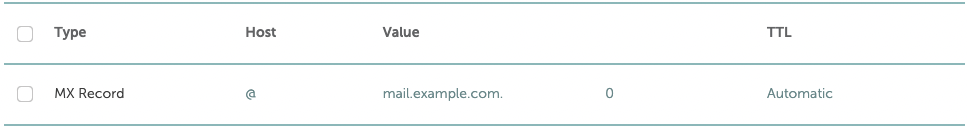
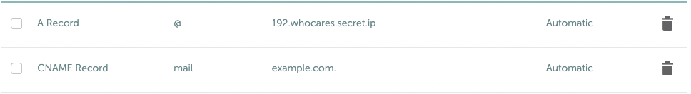

# docker-mailserver

[![ci::status]][ci::github] [![docker::pulls]][docker::hub]

[ci::status]: https://img.shields.io/github/actions/workflow/status/kristijorgji/docker-mailserver/ci.yml?branch=main&color=blue&label=CI&logo=github&logoColor=white&style=for-the-badge
[ci::github]: https://github.com/kristijorgji/docker-mailserver/actions
[docker::pulls]: https://img.shields.io/docker/pulls/kristijorgji/docker-mailserver.svg?style=for-the-badge&logo=docker&logoColor=white
[docker::hub]: https://hub.docker.com/r/kristijorgji/docker-mailserver/

1. [About](#about)
2. [Repository layout](docs/repository-layout.md) — **read before editing `configs/`**
3. [Requirements](#requirements)
4. [How to use](#how-to-use)
5. [Spam protection](#spam-protection)
   - [Enabled by default (Tier 0)](#enabled-by-default-tier-0--no-extra-ram)
   - [Where detected spam goes](#where-detected-spam-goes)
   - [Optional (configurable)](#optional-configurable)
6. [TLS / certificates](#tls--certificates)
   - [External mode](#external-mode-host-managed-certificates)
   - [Internal mode](#internal-mode)
7. [Configuration reference](#configuration-reference)
8. [Ports and mail clients](#ports-and-mail-clients)
9. [Webmail (optional)](#webmail-optional)
10. [Backup and restore](#backup-and-restore)
    - [What is backed up](#what-is-backed-up)
    - [What is NOT backed up](#what-is-not-backed-up)
    - [Create a backup](#create-a-backup)
    - [Restore from backup](#restore-from-backup)
11. [Deliverability checklist](#deliverability-checklist)
12. [How to update domains and users](#how-to-update-domains-and-users)
13. [Aliases, discard transports, SendGrid relay](#aliases-discard-transports-sendgrid-relay)
    - [Aliases](#aliases)
    - [Noreply / discard transports](#noreply--discard-transports)
    - [SendGrid outbound relay](#sendgrid-outbound-relay)
14. [Thunderbird setup](docs/thunderbird/how-to-connect-with-thunderbird.md)
15. [Develop locally](#develop-locally)
    - [Share a pre-release image](#share-a-pre-release-image-before-tagging-a-release)
16. [Test and troubleshoot](docs/how-to-test-and-troubleshoot-the-setup.md)
17. [CI and releases](#ci-and-releases)

## About

A Docker image providing a production-oriented mail server with:

- **Postfix** (SMTP) with Postscreen + DNS blocklists (enabled by default)
- **Dovecot** (IMAP/POP3/LMTP) with MySQL virtual users
- **OpenDKIM** outbound signing (enabled by default)
- **Optional** Rspamd content filtering, postgrey greylisting, SnappyMail webmail
- Multiple domains, aliases, discard transports, SendGrid sender-dependent relay

Mail is stored in Maildir at `/var/mail/vhosts/%d/%n/`. User and domain metadata lives in MySQL.

See [Repository layout](docs/repository-layout.md) for a full map of `configs/` (defaults in `vars.yml`,
secrets in `vault.yml`, Jinja templates per service).

## Requirements

**Tools**

- [Docker](https://www.docker.com/)
- [Docker Compose](https://docs.docker.com/compose/)

**DNS and network prerequisites**

- Your **MX record** points to the host where this mailserver runs
  - 
- Your _mailserver domain_ **A record (or CNAME)** points to the same host (e.g. `mail.example.com`)
  - 
- For **`tls_cert_mode: internal`**: port **80** on the mail hostname must reach this host (or your webserver)
  so Let's Encrypt can issue and renew certificates
- Open firewall / security group ports for the services you use. **Required for typical clients:** **465**
  (SMTPS) and **143** or **993** (IMAP/IMAPS). **587** (submission) is recommended for sending.
  Inbound SMTP uses **25**.

  ```text
  25     # SMTP (inbound)
  465    # SMTPS (outbound)
  587    # SMTP submission (outbound, recommended)
  143    # IMAP (optional; off by default — use 993 instead)
  993    # IMAPS (recommended)
  995    # POP3S (optional)
  ```

  Plain POP3 port **110** is not used.

- For deliverability: SPF, DKIM, DMARC, and reverse DNS (PTR) — see [Deliverability checklist](#deliverability-checklist)

**System requirements**

| Profile      | CPU     | RAM                | Notes                                             |
| ------------ | ------- | ------------------ | ------------------------------------------------- |
| Recommended  | 1 core  | 2 GB + swap        | Default stack with OpenDKIM + Postscreen          |
| Minimum      | 1 vCore | 512 MB–1 GB + swap | Keep `enable_rspamd: false`; use Tier-0 spam only |
| + Rspamd     | 1 core  | +80–150 MB RAM     | Set `enable_rspamd: true` in `vars.yml`           |
| + SnappyMail | —       | +50 MB RAM         | Separate container; `enable_webmail: true`        |

**Persistent directories** (created by `install.sh`):

| Path                 | Purpose                                                       |
| -------------------- | ------------------------------------------------------------- |
| `./data/mysql`       | Virtual domains, users, aliases (survives container recreate) |
| `./data/letsencrypt` | TLS certificates when using `tls_cert_mode: internal`         |
| `./mail`             | Mailbox storage                                               |

## How to use

```shell
curl -LJO https://raw.githubusercontent.com/kristijorgji/docker-mailserver/main/install.sh \
 && chmod a+x install.sh \
 && ./install.sh docker-mailserver
```

Edit before first start:

- `configs/vars/vault.yml` — secrets, domains, accounts (**change all `CHANGE_ME` passwords**)
- `configs/vars/vars.yml` — feature toggles, TLS mode, DNSBL lists
- `.env` — image tag and mail data path

```shell
cd docker-mailserver
./scripts/up.sh
./update.sh    # sync vault.yml users/domains into MySQL
```

Follow logs: `docker-compose logs -f ms`

**External certificate management:** when a host orchestration layer (Ansible, shell provisioner, platform team)
manages TLS, mount host certificates read-only, set `tls_cert_mode: external` in `vars.yml`, and reload
Postfix/Dovecot from a host deploy hook after renewal. The container does not run certbot in that mode.

## Spam protection

### Enabled by default (Tier 0 — no extra RAM)

- **Postscreen** with DNS blocklists before full SMTP sessions
- **HELO/sender** validation (`reject_invalid_helo_hostname`, `reject_non_fqdn_`\*)
- `**reject_rbl_client`\*\* using `mail_dnsbl_servers` (default: `zen.spamhaus.org`)

Configure lists in `configs/vars/vars.yml`:

```yaml
mail_dnsbl_servers:
  - zen.spamhaus.org
```

Aggressive lists (e.g. UCEPROTECT) can cause false positives — add only if you accept that tradeoff.

### Where detected spam goes

| Layer              | Default | What happens                                                                                                    |
| ------------------ | ------- | --------------------------------------------------------------------------------------------------------------- |
| Postscreen + DNSBL | On      | **Rejected at SMTP** — never stored; sender gets a bounce                                                       |
| RBL / HELO checks  | On      | **Rejected at SMTP**                                                                                            |
| postgrey           | Off     | Temporarily deferred (greylist); legit servers retry                                                            |
| Rspamd             | Off     | **Inbox** with `X-Spam` headers, or **Junk** folder when `enable_rspamd_junk_sieve: true` (default with Rspamd) |

DNSBL blocks are **not 100% accurate** — rare false positives bounce legitimate mail.
Spamhaus ZEN is conservative but not infallible.

If you enable Rspamd with `enable_rspamd_junk_sieve: true` (default when Rspamd is on), tagged spam is filed
into the **Junk** folder server-side. Set `enable_rspamd_junk_sieve: false` to keep spam in Inbox with headers
only. Hard discard of Rspamd-scored mail is **not recommended** without a Junk/quarantine path.

### Optional (configurable)

| Variable              | Default | RAM        | Description                                       |
| --------------------- | ------- | ---------- | ------------------------------------------------- |
| `enable_rspamd`       | `false` | ~80–150 MB | Content scoring; adds `X-Spam` headers via milter |
| `enable_postgrey`     | `false` | ~10–30 MB  | Greylisting for unknown senders                   |
| `enable_rspamd_bayes` | `false` | +30–80 MB  | Bayesian learning (needs Redis for full benefit)  |

After enabling, run `./update.sh` and ensure the host has enough RAM (~2 GB recommended with Rspamd).

**Headers to expect**

- `DKIM-Signature` — OpenDKIM (always on)
- `X-Spam` / `X-Spamd-Result` — when Rspamd is enabled

## TLS / certificates

Set `tls_cert_mode` in `configs/vars/vars.yml`:

| Mode          | Who creates cert               | Who renews                             | Volume                                                       |
| ------------- | ------------------------------ | -------------------------------------- | ------------------------------------------------------------ |
| `self_signed` | Container (`env: local`)       | N/A                                    | —                                                            |
| `internal`    | Container certbot (standalone) | In-container cron + deploy hook reload | `./data/letsencrypt:/etc/letsencrypt`                        |
| `external`    | **Host / orchestration layer** | **Host certbot** deploy hook           | Mount host path, e.g. `/etc/letsencrypt:/etc/letsencrypt:ro` |

Certificate paths (all modes):

```yaml
mail_server_cert_path: "/etc/letsencrypt/live/mail.example.com/fullchain.pem"
mail_server_key_path: "/etc/letsencrypt/live/mail.example.com/privkey.pem"
```

### External mode (host-managed certificates)

Typical for production when an external Ansible role, platform provisioner, or ops team runs certbot on the host:

1. Issue certificates on the **host** (port 80 available to certbot or your proxy).
2. Mount `/etc/letsencrypt` (or your paths) into the `ms` container read-only.
3. Set `tls_cert_mode: external` and `env: production`.
4. On renewal, reload services inside the container from a host deploy hook:

```shell
docker compose exec -T ms bash -c 'service postfix reload && service dovecot reload'
```

The container **never** runs certbot in external mode.

### Internal mode

Requires port **80** free for initial issuance. Renewal runs daily at 03:00 via cron;
`/etc/letsencrypt/renewal-hooks/deploy/mailserver.sh` reloads Postfix and Dovecot.

## Configuration reference

**`configs/vars/vars.yml`** (non-secret defaults)

**TLS and spam (Tier 0)**

| Variable             | Default              | Description                               |
| -------------------- | -------------------- | ----------------------------------------- |
| `tls_cert_mode`      | `internal`           | `self_signed` \| `internal` \| `external` |
| `mail_dnsbl_servers` | `[zen.spamhaus.org]` | DNSBL hosts for Postscreen/RBL            |

**Spam / filtering** (~80–150 MB RAM when Rspamd on)

| Variable                   | Default | Description                                           |
| -------------------------- | ------- | ----------------------------------------------------- |
| `enable_rspamd`            | `false` | Content spam filter (~80–150 MB RAM)                  |
| `enable_postgrey`          | `false` | Greylisting (~10–30 MB RAM)                           |
| `enable_rspamd_bayes`      | `false` | Rspamd Bayesian learning (+30–80 MB RAM)              |
| `enable_rspamd_junk_sieve` | `true`  | Move Rspamd-tagged mail to Junk (only when Rspamd on) |

**Webmail** (~50 MB RAM, SnappyMail sidecar container)

| Variable         | Default | Description                    |
| ---------------- | ------- | ------------------------------ |
| `enable_webmail` | `false` | SnappyMail sidecar (see below) |

**Dovecot auth cache** (~10M RAM, default on)

| Variable                     | Default  | Description          |
| ---------------------------- | -------- | -------------------- |
| `dovecot_auth_cache_enabled` | `true`   | Cache auth in RAM    |
| `dovecot_auth_cache_size`    | `10M`    | Hard cap             |
| `dovecot_auth_cache_ttl`     | `1 hour` | Cache entry lifetime |

**Exposure / lifecycle**

| Variable                 | Default | Description                         |
| ------------------------ | ------- | ----------------------------------- |
| `expose_imap_plain`      | `false` | Expose IMAP port 143                |
| `prune_removed_accounts` | `false` | Delete DB users not listed in vault |

**Abuse protection** (negligible RAM/CPU, on by default)

**Outbound** (ports 587/465, authenticated send; limits per `outbound_anvil_time_unit`, default **1 hour**)

| Variable                        | Default | Description                                      |
| ------------------------------- | ------- | ------------------------------------------------ |
| `enable_outbound_rate_limits`   | `true`  | Postfix anvil + postfwd send limits              |
| `outbound_anvil_time_unit`      | `3600s` | Rate-limit window (change to rescale all limits) |
| `outbound_user_message_limit`   | `100`   | Messages per mailbox per window                  |
| `outbound_user_recipient_limit` | `50`    | Distinct recipients per mailbox per window       |

**Inbound** (port 25 MX, per client IP; limits per `inbound_anvil_time_unit`, default **60 seconds**)

| Variable                                | Default | Description                                                  |
| --------------------------------------- | ------- | ------------------------------------------------------------ |
| `enable_inbound_rate_limits`            | `true`  | Postfix anvil flood limits on inbound `smtpd` (no extra RAM) |
| `inbound_anvil_time_unit`               | `60s`   | Rate-limit window for inbound connections                    |
| `inbound_client_connection_rate_limit`  | `30`    | New SMTP connections per IP per window                       |
| `inbound_client_connection_count_limit` | `10`    | Concurrent SMTP sessions per IP                              |
| `inbound_message_rate_limit`            | `30`    | MAIL FROM commands per IP per window                         |
| `inbound_recipient_rate_limit`          | `60`    | RCPT TO commands per IP per window                           |
| `inbound_rate_limit_exceptions`         | `[]`    | CIDRs that bypass inbound limits (trusted relays)            |

Exceeding outbound limits returns `452`/`554` on submission. Exceeding inbound limits returns `421`/`450`
(temporary) from the MX. Disable either direction with `enable_outbound_rate_limits: false` or
`enable_inbound_rate_limits: false`.

**Storage quotas** (disk per mailbox; negligible RAM, on by default)

| Variable                          | Default | Description                                                                                          |
|-----------------------------------|---------|------------------------------------------------------------------------------------------------------|
| `enable_mailbox_quotas`           | `true`  | Dovecot disk quotas via MySQL                                                                        |
| `mailbox_quota_default`           | `5G`    | Default **disk** limit (override per account/domain in vault)                                        |
| `mailbox_quota_warning_threshold` | `90`    | At this % used, Dovecot emails the mailbox user via local Postfix (`quota-warning`)                  |

**`configs/vars/vault.yml`** — `mysql_*` credentials, `mail_domains`, `mail_accounts`, aliases, transports,
relay API keys.

**Mailbox quota inheritance** (disk storage, same model as Google Workspace / M365 per-user limits):

1. Per-account `quota` in `mail_accounts` (wins)
2. Per-domain `mailbox_quota` in `mail_domains`
3. Global `mailbox_quota_default` in `vars.yml`

Use `quota: 0` or `unlimited` on an account to opt out. **Thunderbird** can show used/limit via **IMAP QUOTA**
(server must advertise it). Quota warnings are a **server email to the user** (not a Thunderbird/client popup).
A bare `storage=N%` Dovecot rule without a `quota-warning` command breaks IMAP after successful auth
(SnappyMail can show `CAPABILITY Logged in as (null)`).

Optional per-account / per-domain overrides in vault (`outbound_*` limits are **per hour** unless you change `outbound_anvil_time_unit`):

```yaml
mail_domains:
  - {
      id: 1,
      name: "example.com",
      mailbox_quota: 10G,
      outbound_message_limit: 500,
    } # 10G disk; 500 msgs/hour
mail_accounts:
  - {
      id: 1,
      name: "me@example.com",
      password: "...",
      quota: 2G,
      outbound_message_limit: 1000,
    } # 2G disk; 1000 msgs/hour
```

**Outbound rate limits:** when exceeded, SMTP submission returns `452`/`554` and the message is not queued.
**Inbound rate limits:** when exceeded, the MX returns `421`/`450` to the sending host (temporary deferral).
**Mailbox quotas:** when full, inbound mail bounces to the sender (`552 5.2.2`); users can delete mail via IMAP
to free disk space. Check usage: `doveadm quota get -u me@example.com`.

Provisioning is **idempotent**: `./update.sh` upserts users/domains without wiping the database.
Boot only applies schema and config templates.

## Ports and mail clients

| Port | Service         | Recommended                          |
| ---- | --------------- | ------------------------------------ |
| 25   | SMTP (inbound)  | Required for receiving mail          |
| 587  | SMTP submission | **Yes** — client outbound            |
| 465  | SMTPS           | Alternative outbound                 |
| 993  | IMAPS           | **Yes** — client inbound             |
| 995  | POP3S           | Optional — IMAP 993 is recommended   |
| 143  | IMAP (STARTTLS) | Off by default (`expose_imap_plain`) |

Port **110** (plain POP3) is not used. POP3S on **995** is available when needed; most clients should use **IMAP 993** instead.

## Webmail (optional)

[SnappyMail](https://github.com/the-djmaze/snappymail) webmail (~50 MB RAM sidecar, no database).

```yaml
# configs/vars/vars.yml
enable_webmail: true
```

```shell
./scripts/up.sh
```

When `enable_webmail: true` in `vars.yml`, `./scripts/up.sh` starts the SnappyMail sidecar and seeds
domain backends to **`ms:993` (IMAPS)** and **`ms:465` (SMTPS)** with SASL **`PLAIN`/`LOGIN` only**
(matches Dovecot `auth_mechanisms`; see
[`configs/snappymail/default.json`](configs/snappymail/default.json) and
[`scripts/seed-snappymail-domains.sh`](scripts/seed-snappymail-domains.sh)). Stock SnappyMail
`localhost:143` / SCRAM defaults do not work in this layout (`expose_imap_plain` is off).

Open `http://localhost:8888` (or your reverse-proxied hostname). Log in with the **full email
address** and mailbox password. Complete the SnappyMail admin wizard only if you need admin settings;
IMAP/SMTP backends are already provisioned for Docker Compose.

## Backup and restore

Back up **before upgrades**, before enabling `prune_removed_accounts`, or on a regular schedule.

### What is backed up

| Path           | Contents                                              |
| -------------- | ----------------------------------------------------- |
| `./data/mysql` | Virtual domains, users, aliases, transports           |
| `./mail`       | Maildir mailboxes (`MAILSERVER_MAILS_PATH` in `.env`) |

### What is NOT backed up

- External TLS certificates when `tls_cert_mode: external` (managed on the host — back up host `/etc/letsencrypt` separately)
- SnappyMail data (`./data/snappymail`) unless you add it to your own backup
- `configs/vars/vault.yml` (secrets — store securely outside the archive)

### Create a backup

From the install root:

```shell
./scripts/backup/backup.sh
```

Output: `./backups/mailserver-YYYY-MM-DD_HHMMSS.tar.gz`

Example cron (daily at 02:00):

```cron
0 2 * * * cd /path/to/docker-mailserver && ./scripts/backup/backup.sh
```

### Restore from backup

```shell
./scripts/backup/restore.sh ./backups/mailserver-YYYY-MM-DD_HHMMSS.tar.gz
```

This stops the container, restores `./data/mysql` and `./mail`, starts the container, and runs `./update.sh`.
You must type `yes` to confirm.

For version-specific upgrade notes, see [CHANGELOG.md](CHANGELOG.md).

## Deliverability checklist

1. **MX** → your mail host
2. **A/CNAME** for `mail.example.com`
3. **PTR** (reverse DNS) matches `mail.example.com`
4. **SPF** TXT: `v=spf1 mx -all` (adjust if using SendGrid relay)
5. **DKIM** — after `./update.sh`, publish TXT for each domain:

```shell
docker-compose exec ms cat /etc/opendkim/keys/example.com/mail.txt
```

Record name: `mail._domainkey.example.com`

1. **DMARC** TXT: `_dmarc.example.com` → `v=DMARC1; p=none; rua=mailto:dmarc@example.com`

## How to update domains and users

Edit `configs/vars/vault.yml`, then:

```shell
./update.sh
```

This runs `db-provision` (upsert), re-renders Postfix/Dovecot/OpenDKIM templates, and reloads services. Safe to run repeatedly.

Account `domainId` is resolved from the email domain when omitted:

```yaml
mail_domains:
  - { id: 1, name: "example.com" }
  - { id: 2, name: "other.com" }
mail_accounts:
  - { id: 1, name: "me@example.com", password: "secret" }
  - { id: 2, name: "admin@other.com", password: "secret", domainId: 2 }
```

## Aliases, discard transports, SendGrid relay

## Aliases

```yaml
mail_virtual_aliases:
  - {
      id: 1,
      domainId: 1,
      source: "myfriend@example.com",
      destination: "me@example.com",
    }
```

## Noreply / discard transports

```yaml
mail_virtual_transports:
  - { id: 1, domainId: 1, email: "noreply@example.com", transport: discard }
```

Verify: `docker-compose exec ms postmap -q mysql:/etc/postfix/mysql-virtual-transports.cf noreply@example.com`

## SendGrid outbound relay

See `mail_relay_profiles` in `vars.yml` and `mail_sender_relays` / `sendgrid_relay_api_keys` in `vault.yml`.

After changes: `./update.sh`

## Develop locally

Clone the repo and build the image locally — no Docker Hub release tag required
(`docker-compose.yml` uses `build: context: .`).

```shell
bash scripts/dev-init.sh
# Edit configs/vars/vault.yml — use non-CHANGE_ME passwords for local boot
docker compose up -d --build
./update.sh
bash tests/smoke.bash
```

`dev-init.sh` configures git pre-commit hooks (`make verify-hooks`), copies `vault.example.yml` when missing,
and creates dev data directories.

Production installs use `install.sh` and pull `MAILSERVER_IMAGE` from `.env`; developers use **build**, not Hub tags.

### Share a pre-release image (before tagging a release)

To let a colleague test on a server without creating a GitHub Release:

| Tag          | Source                                                             | Use                       |
| ------------ | ------------------------------------------------------------------ | ------------------------- |
| `edge`       | Merge to `main` ([push-edge.yml](.github/workflows/push-edge.yml)) | Moving tip of main        |
| `sha-<7hex>` | Same workflow (also immutable)                                     | Pin to a specific commit  |
| `dev-<7hex>` | Local [`ci/push-to-docker.sh`](ci/push-to-docker.sh)               | Manual share before merge |

**Immutable pins:** push a **new** `dev-<shortsha>` for each smoke; do **not** overwrite an existing
`dev-*` / `sha-*` tag. Orchestration that syncs host configs (e.g. Ansible
`docker_mailserver_config_ref`) should use the **same** short SHA as the image so Hub image and
GitHub archive stay paired. Commit and push git first, then:

```shell
PUSH_PLATFORMS=linux/amd64 \   # or omit for amd64+arm64
IMAGE_NAME=docker-mailserver \
DOCKER_HUB_USERNAME=kristijorgji \
DOCKER_HUB_AUTH=... \
  bash ci/push-to-docker.sh
# → kristijorgji/docker-mailserver:dev-<new7hex>
# Set MAILSERVER_IMAGE / docker_mailserver_image and config_ref to that SHA, then redeploy.
```

Hub tags from `publish.yaml`, `push-edge.yml`, and `ci/push-to-docker.sh`
are **multi-arch** (`linux/amd64` + `linux/arm64`) unless you override `PUSH_PLATFORMS`. Clients pull
the matching architecture automatically. Local `ci/push-to-docker.sh` creates/uses a
`docker-container` buildx builder when more than one platform is requested (Desktop’s default
`docker` driver cannot push multi-arch).

```shell
# Local push (requires Docker Hub credentials in env); multi-arch by default
IMAGE_NAME=docker-mailserver \
DOCKER_HUB_USERNAME=kristijorgji \
DOCKER_HUB_AUTH=... \
  bash ci/push-to-docker.sh
# → kristijorgji/docker-mailserver:dev-<shortsha>

# Faster single-arch override (e.g. amd64-only for an EC2 smoke test):
PUSH_PLATFORMS=linux/amd64 \
IMAGE_NAME=docker-mailserver \
DOCKER_HUB_USERNAME=kristijorgji \
DOCKER_HUB_AUTH=... \
  bash ci/push-to-docker.sh
```

Colleague / remote server (release compose + `.env`):

```shell
MAILSERVER_IMAGE=kristijorgji/docker-mailserver:edge
# or: MAILSERVER_IMAGE=kristijorgji/docker-mailserver:sha-abc1234
# or: MAILSERVER_IMAGE=kristijorgji/docker-mailserver:dev-abc1234
```

Release tags `vX.Y.Z` are reserved for [`publish.yaml`](.github/workflows/publish.yaml) (image + GitHub Release).
`ci/push-to-docker.sh` refuses those tags so local pushes cannot look like releases.

**Prune stale non-prod Hub tags** with [`ci/delete-dockerhub-tags.sh`](ci/delete-dockerhub-tags.sh)
(dry-run by default; matches `dev-*` only; never deletes `v*`). After a new pin is verified:

```shell
IMAGE_NAME=docker-mailserver \
DOCKER_HUB_USERNAME=kristijorgji \
DOCKER_HUB_AUTH=... \
  bash ci/delete-dockerhub-tags.sh --keep-head-dev          # dry-run
  bash ci/delete-dockerhub-tags.sh --keep-head-dev --yes    # delete other dev-*
# Also prune sha-* older than two weeks:
  bash ci/delete-dockerhub-tags.sh --prefixes dev-,sha- --older-than 14 --yes
```

**Shortcut:** `make ress` (rebuild + restart), then `./update.sh`.

Local mode uses `configs/vars/local.yml` (`env: local`, `tls_cert_mode: self_signed`).

Inside the container (dev mount):
`cd /dev-docker-data/ansible && ansible-playbook playbook.yml --tags db-provision,postfix-provision,reload`

Manual hook setup (if you skip `dev-init.sh`):

```shell
git config core.hooksPath git_hooks
chmod +x git_hooks/pre-commit git_hooks/pre-commit.d/*
make verify-hooks
```

See [docs/repository-layout.md](docs/repository-layout.md) for how configs, Ansible templates, and runtime data fit together.

## Test and troubleshoot

See [docs/how-to-test-and-troubleshoot-the-setup.md](docs/how-to-test-and-troubleshoot-the-setup.md).

Smoke tests: `bash tests/smoke.bash` (with running compose stack).

## CI and releases

**Pull requests** to `main` run the [CI workflow](.github/workflows/ci.yml):

| Job                  | Checks                                                                                                                             |
| -------------------- | ---------------------------------------------------------------------------------------------------------------------------------- |
| `smoke-test`         | Build, `./update.sh`, Postscreen/DNSBL, open-relay, IMAP auth, rate limits, quotas, upsert, backup/restore, idempotent `update.sh` |
| `rspamd-render-test` | Rspamd milter config and service with `enable_rspamd: true`                                                                        |
| `lint-markdown`      | `make lint-markdown` on all `*.md` files                                                                                           |

To require CI before merge, enable branch protection on `main` and require these status checks:
`smoke-test`, `rspamd-render-test`, and `lint-markdown`.

**Releases:** tag `vX.Y.Z` pushes the Docker image and creates a GitHub Release with notes from
[CHANGELOG.md](CHANGELOG.md). See release history:
[https://github.com/kristijorgji/docker-mailserver/releases](https://github.com/kristijorgji/docker-mailserver/releases)

**Pre-release images** (no GitHub Release): merges to `main` push `:edge` and `:sha-<short>` via
[push-edge.yml](.github/workflows/push-edge.yml). For a one-off colleague test from your laptop, use
[`ci/push-to-docker.sh`](ci/push-to-docker.sh) (`:dev-<short>`). See [Share a pre-release image](#share-a-pre-release-image-before-tagging-a-release).
