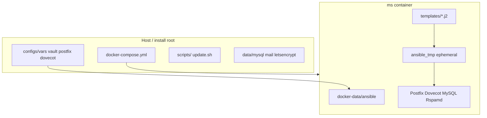

# Repository layout

How the docker-mailserver repo is organized: host install root, container internals, and where configuration is rendered.

**Read this before editing `configs/`** — defaults live in [`configs/vars/vars.yml`](../configs/vars/vars.yml);
secrets and mail data in [`configs/vars/vault.yml`](../configs/vars/vault.yml). Jinja templates under `configs/`
are rendered into the container by Ansible; do not duplicate defaults inside `.j2` files.

## Table of contents

- [Overview](#overview)
- [Top-level directories](#top-level-directories)
- [configs/ directory map](#configs-directory-map)
- [Configuration split](#configuration-split-vars-vs-templates)
- [Docker Compose files (dev vs release)](#docker-compose-files-dev-vs-release)
- [Ansible flow](#ansible-flow)
- [TLS modes](#tls-modes)
- [Optional features](#optional-features)
- [Backup paths](#backup-paths)
- [Local development vs release install](#local-development-vs-release-install)

## Overview

## Top-level directories

| Path                                          | Purpose                                                             |
| --------------------------------------------- | ------------------------------------------------------------------- |
| [`configs/`](../configs/)                     | User-edited Jinja templates and Ansible vars (see below)            |
| [`docker-data/`](../docker-data/)             | Image content: entrypoint, Ansible playbook, roles, static files    |
| [`scripts/`](../scripts/)                     | Host helpers: `dev-init.sh`, `up.sh`, `down.sh`, `backup/`          |
| [`tests/`](../tests/)                         | CI and local smoke/render tests                                     |
| [`.github/workflows/`](../.github/workflows/) | CI, publish, Ubuntu base digest check                               |
| `data/`                                       | Persistent MySQL and Let's Encrypt (gitignored; created at install) |
| `mail/`                                       | Maildir storage (gitignored)                                        |

Root files: `Dockerfile`, `docker-compose.yml`, `docker-compose.release.yml`, `install.sh`, `update.sh`, `Makefile`.

### `scripts/` tree

| Script                                              | Audience      | Purpose                                                                         |
| --------------------------------------------------- | ------------- | ------------------------------------------------------------------------------- |
| [`dev-init.sh`](../scripts/dev-init.sh)             | Developers    | One-time clone bootstrap: git hooks, executable bits, vault template, data dirs |
| [`check-hooks.sh`](../scripts/check-hooks.sh)       | Developers    | Verify `git_hooks` installed (`make verify-hooks`)                              |
| [`up.sh`](../scripts/up.sh)                         | Install / ops | Start stack (+ SnappyMail when enabled)                                         |
| [`down.sh`](../scripts/down.sh)                     | Install / ops | Stop stack                                                                      |
| [`backup/backup.sh`](../scripts/backup/backup.sh)   | Install / ops | Archive MySQL + maildir                                                         |
| [`backup/restore.sh`](../scripts/backup/restore.sh) | Install / ops | Restore from archive                                                            |

Git hook setup is **not** part of [`install.sh`](../install.sh) (production curl install).
Developers run `bash scripts/dev-init.sh` after clone.

## `configs/` directory map

### `configs/vars/` — Ansible variables (loaded on every `./update.sh`)

| File                                                     | Purpose                                                                                                                    |
| -------------------------------------------------------- | -------------------------------------------------------------------------------------------------------------------------- |
| [`vars.yml`](../configs/vars/vars.yml)                   | **Defaults and feature toggles** (no secrets): spam, webmail, quotas, TLS mode, rate limits, DNSBL list                    |
| [`vault.yml`](../configs/vars/vault.yml)                 | **Secrets and mail data** (gitignored; copy from `vault.example.yml`): MySQL passwords, domains, accounts, aliases, relays |
| [`vault.example.yml`](../configs/vars/vault.example.yml) | Example vault structure for new installs                                                                                   |
| [`local.yml`](../configs/vars/local.yml)                 | Dev overrides: `env: local`, `tls_cert_mode: self_signed`                                                                  |
| `zzz-*.yml`                                              | Optional overlays loaded last (e.g. CI Rspamd overlay)                                                                     |

### `configs/postfix/` — SMTP (rendered to `/etc/postfix/`)

| File                                                                                            | Purpose                                                                                           |
| ----------------------------------------------------------------------------------------------- | ------------------------------------------------------------------------------------------------- |
| [`main.cf.j2`](../configs/postfix/main.cf.j2)                                                   | Core Postfix: TLS, SASL, milters (OpenDKIM/Rspamd), Postscreen DNSBL, restrictions, postgrey hook |
| [`master.cf.j2`](../configs/postfix/master.cf.j2)                                               | Services and ports: postscreen, submission 587, smtps 465, inbound/outbound anvil rate limits     |
| [`postfwd.cf.j2`](../configs/postfix/postfwd.cf.j2)                                             | Outbound per-user/domain send rate rules (postfwd policy server)                                  |
| [`mysql-virtual-mailbox-domains.cf.j2`](../configs/postfix/mysql-virtual-mailbox-domains.cf.j2) | MySQL lookup: valid recipient domains                                                             |
| [`mysql-virtual-mailbox-maps.cf.j2`](../configs/postfix/mysql-virtual-mailbox-maps.cf.j2)       | MySQL lookup: mailbox → Maildir path                                                              |
| [`mysql-virtual-alias-maps.cf.j2`](../configs/postfix/mysql-virtual-alias-maps.cf.j2)           | MySQL lookup: email aliases                                                                       |
| [`mysql-virtual-transports.cf.j2`](../configs/postfix/mysql-virtual-transports.cf.j2)           | MySQL lookup: per-address transports (e.g. discard)                                               |
| [`mysql-virtual-email2email.cf.j2`](../configs/postfix/mysql-virtual-email2email.cf.j2)         | MySQL lookup: catch-all / domain-wide forwarding                                                  |
| [`sender_dependent_relayhost.j2`](../configs/postfix/sender_dependent_relayhost.j2)             | Outbound smarthost per sender (SendGrid relay)                                                    |
| [`sasl_passwd.j2`](../configs/postfix/sasl_passwd.j2)                                           | SASL credentials for sender-dependent relay hosts                                                 |

### `configs/dovecot/` — IMAP/POP3/LMTP (rendered to `/etc/dovecot/`)

| File                                                                                    | Purpose                                                  |
| --------------------------------------------------------------------------------------- | -------------------------------------------------------- |
| [`dovecot.conf.j2`](../configs/dovecot/dovecot.conf.j2)                                 | Main Dovecot config; includes quota dict when enabled    |
| [`dovecot-sql.conf.ext.j2`](../configs/dovecot/dovecot-sql.conf.ext.j2)                 | SQL auth and userdb for virtual users                    |
| [`dovecot-dict-sql.conf.ext.j2`](../configs/dovecot/dovecot-dict-sql.conf.ext.j2)       | SQL dict backend for mailbox quota usage                 |
| [`conf.d/10-auth.conf.j2`](../configs/dovecot/conf.d/10-auth.conf.j2)                   | Authentication: plaintext policy, auth cache             |
| [`conf.d/10-logging.conf.j2`](../configs/dovecot/conf.d/10-logging.conf.j2)             | Log levels and paths                                     |
| [`conf.d/10-mail.conf.j2`](../configs/dovecot/conf.d/10-mail.conf.j2)                   | Mail location (Maildir), UID/GID                         |
| [`conf.d/10-master.conf.j2`](../configs/dovecot/conf.d/10-master.conf.j2)               | Listeners: IMAPS 993, POP3S 995, optional plain IMAP 143 |
| [`conf.d/10-ssl.conf.j2`](../configs/dovecot/conf.d/10-ssl.conf.j2)                     | TLS certificate paths (shared with Postfix)              |
| [`conf.d/15-mailboxes.conf.j2`](../configs/dovecot/conf.d/15-mailboxes.conf.j2)         | Special-use `Junk` mailbox when Rspamd + Sieve enabled   |
| [`conf.d/90-quota.conf.j2`](../configs/dovecot/conf.d/90-quota.conf.j2)                 | Quota plugin, IMAP QUOTA, warning threshold emails       |
| [`conf.d/90-sieve.conf.j2`](../configs/dovecot/conf.d/90-sieve.conf.j2)                 | Global Sieve script path when Rspamd Junk routing on     |
| [`conf.d/auth-sql.conf.ext.j2`](../configs/dovecot/conf.d/auth-sql.conf.ext.j2)         | SQL passdb/userdb driver include                         |
| [`conf.d/auth-system.conf.ext.j2`](../configs/dovecot/conf.d/auth-system.conf.ext.j2)   | System/PAM auth (disabled for virtual-user setups)       |
| [`sieve/global-spam-to-junk.sieve`](../configs/dovecot/sieve/global-spam-to-junk.sieve) | Moves `X-Spam: Yes` mail to Junk (compiled by Ansible)   |

### `configs/opendkim/` — outbound signing (rendered to `/etc/opendkim/`)

| File                                                       | Purpose                                          |
| ---------------------------------------------------------- | ------------------------------------------------ |
| [`opendkim.conf.j2`](../configs/opendkim/opendkim.conf.j2) | OpenDKIM daemon: socket, key paths, signing mode |
| [`KeyTable.j2`](../configs/opendkim/KeyTable.j2)           | Maps domain selector → private key file          |
| [`SigningTable.j2`](../configs/opendkim/SigningTable.j2)   | Maps From addresses → selector                   |
| [`TrustedHosts.j2`](../configs/opendkim/TrustedHosts.j2)   | Hosts allowed to submit mail for signing         |

### `configs/rspamd/local.d/` — optional spam filter (when `enable_rspamd: true`)

| File                                                                         | Purpose                                                          |
| ---------------------------------------------------------------------------- | ---------------------------------------------------------------- |
| [`milter.conf.j2`](../configs/rspamd/local.d/milter.conf.j2)                 | Milter socket for Postfix integration                            |
| [`milter_headers.conf.j2`](../configs/rspamd/local.d/milter_headers.conf.j2) | Headers added/modified by Rspamd milter                          |
| [`worker-normal.inc.j2`](../configs/rspamd/local.d/worker-normal.inc.j2)     | Rspamd worker process settings                                   |
| [`options.inc.j2`](../configs/rspamd/local.d/options.inc.j2)                 | Global options; disables Bayes when `enable_rspamd_bayes: false` |
| [`statistic.conf.j2`](../configs/rspamd/local.d/statistic.conf.j2)           | Bayesian classifier toggle                                       |

## Configuration split (vars vs templates)

- **`vars.yml`** — single source of defaults for toggles and limits; referenced by README tables and Jinja `` blocks.
- **`vault.yml`** — domains, accounts, passwords, optional per-account `quota`, `mail_sender_relays`, aliases.
- **`.j2` templates** — render service configs only; no `| default()` for values already defined in `vars.yml`.

Overlay files `configs/vars/zzz-*.yml` load last (e.g. CI Rspamd overlay).

## Docker Compose files (dev vs release)

| File                                                          | Use                                                                                                                       |
| ------------------------------------------------------------- | ------------------------------------------------------------------------------------------------------------------------- |
| [`docker-compose.yml`](../docker-compose.yml)                 | **Local development** — `build:`, live `./docker-data` at `/dev-docker-data`, `./mail`, `./data/`                         |
| [`docker-compose.release.yml`](../docker-compose.release.yml) | **Production** — `${MAILSERVER_IMAGE}`, `${MAILSERVER_MAILS_PATH}`; no source mount                                       |
| [`docker-compose.webmail.yml`](../docker-compose.webmail.yml) | **Optional overlay** — SnappyMail sidecar (`profiles: [webmail]`); kept separate so default installs do not start webmail |

[`install.sh`](../install.sh) copies `docker-compose.release.yml` → `docker-compose.yml` in the install directory
and writes `.env` with `MAILSERVER_MAILS_PATH=./mail`. Production installs must set `MAILSERVER_MAILS_PATH` in
`.env` (no YAML default in the release compose file).

[`scripts/up.sh`](../scripts/up.sh) adds `-f docker-compose.webmail.yml --profile webmail` only when
`enable_webmail: true` in `vars.yml`, then runs
[`scripts/seed-snappymail-domains.sh`](../scripts/seed-snappymail-domains.sh) so IMAP/SMTP point at
`ms:993` / `ms:465` ([`configs/snappymail/default.json`](../configs/snappymail/default.json)).
Keeping webmail as an overlay avoids unused services in the main
compose files and matches the Compose pattern for optional sidecars.

Developers clone the repo and use root `docker-compose.yml` with `build:` and `/dev-docker-data` so Ansible
sources live-mount without rebuilding the image on every edit.

## Ansible flow

Playbook: [`docker-data/ansible/playbook.yml`](../docker-data/ansible/playbook.yml).

| Path             | Role                                                                           |
| ---------------- | ------------------------------------------------------------------------------ |
| `templates/*.j2` | **Source of truth** for generated SQL                                          |
| `ansible_tmp/`   | **Ephemeral** render output; gitignored                                        |
| `tasks/`         | Tagged provision steps (`schema-init`, `db-provision`, `postfix-provision`, …) |
| `roles/certbot/` | Let's Encrypt certificate tasks and renewal scripts                            |
| `files/`         | Static scripts (e.g. `gen-certificate.sh`)                                     |

**Boot** ([`entrypoint.sh`](../docker-data/entrypoint.sh)): `schema-init` + service templates (no `db-provision`).
Entrypoint uses `/dev-docker-data/ansible` when the dev mount is present, otherwise image-baked
`/docker-data/ansible`.

**`./update.sh`**: `db-provision` + reload — syncs `vault.yml` users/domains into MySQL.

Typical `./update.sh` flow:

1. Ansible loads all YAML from `configs/vars/`
2. Templates render to `ansible_tmp/*.sql`
3. `mysql < file` applies schema and virtual-user upserts
4. `postfix-db-provision.sql` is rendered, applied, then deleted
5. Postfix/Dovecot/Rspamd configs reload

## TLS modes

Controlled by `tls_cert_mode` in `vars.yml`:

- **`internal`** — Certbot / Let's Encrypt under `/etc/letsencrypt` (port 80 required on mail hostname)
- **`self_signed`** — dev/local (`local.yml`)
- **`external`** — host-mounted certs; container does not run certbot

Persistent cert data: `./data/letsencrypt` → `/etc/letsencrypt`.

## Optional features

| Feature              | Vars                          | Extra                                                       |
| -------------------- | ----------------------------- | ----------------------------------------------------------- |
| Rspamd               | `enable_rspamd`               | `configs/rspamd/` templates                                 |
| Postgrey             | `enable_postgrey`             | Postfix policy check in `main.cf.j2`                        |
| SnappyMail           | `enable_webmail`              | `docker-compose.webmail.yml` via `scripts/up.sh`            |
| Outbound rate limits | `enable_outbound_rate_limits` | `postfwd.cf.j2` + submission anvil                          |
| Inbound rate limits  | `enable_inbound_rate_limits`  | Port 25 `smtpd` anvil in `master.cf.j2`                     |
| Mailbox quotas       | `enable_mailbox_quotas`       | `90-quota.conf.j2`, `dovecot-dict-sql`, MySQL `quota_bytes` |
| OpenDKIM             | always on                     | `configs/opendkim/`                                         |

## Backup paths

[`scripts/backup/backup.sh`](../scripts/backup/backup.sh) archives `./data/mysql` and `./mail`. Restore with [`scripts/backup/restore.sh`](../scripts/backup/restore.sh).

## Local development vs release install

|         | Clone / develop                               | Production `install.sh`                                      |
| ------- | --------------------------------------------- | ------------------------------------------------------------ |
| Image   | `docker compose up -d --build`                | Pull `MAILSERVER_IMAGE` from `.env`                          |
| Compose | Repo `docker-compose.yml` (build + dev mount) | `docker-compose.release.yml` renamed to `docker-compose.yml` |
| Config  | Edit `configs/vars/vault.yml`                 | Same under install root                                      |
| Hooks   | `bash scripts/dev-init.sh`                    | Not installed by `install.sh`                                |
| Apply   | `./update.sh`                                 | `./update.sh`                                                |
| Tests   | `bash tests/smoke.bash`                       | —                                                            |

See [Develop locally](../README.md#develop-locally) in the README.
