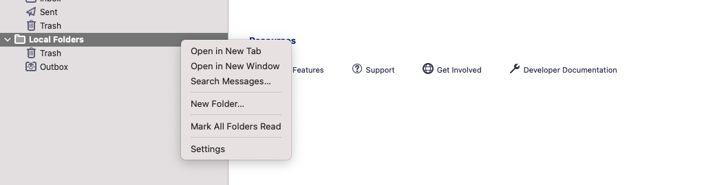
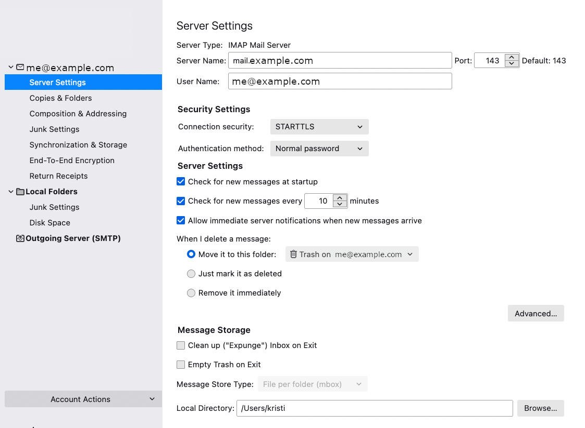
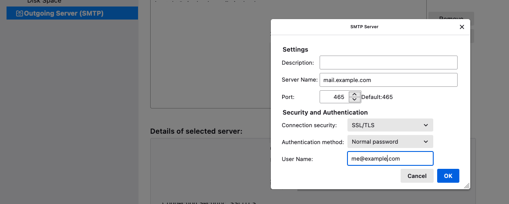

# How to connect with Thunderbird

This guide will show you how to connect to your newly created mailserver with Thunderbird.

The logic and steps are the same across all clients, but as our favorite is Thunderbird we use that one in this example.

1 Right-click on the left sidebar then choose `Settings`

2 Add the new account, in our example `me@example.com`
 

The most important thing here is using port `143`

3 Finally add outgoing smtp server which will allow you to send emails

That is all, now Thunderbird will ask for your password and afterward have fun receiving and sending emails!
