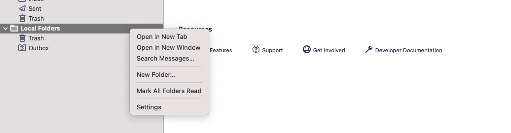
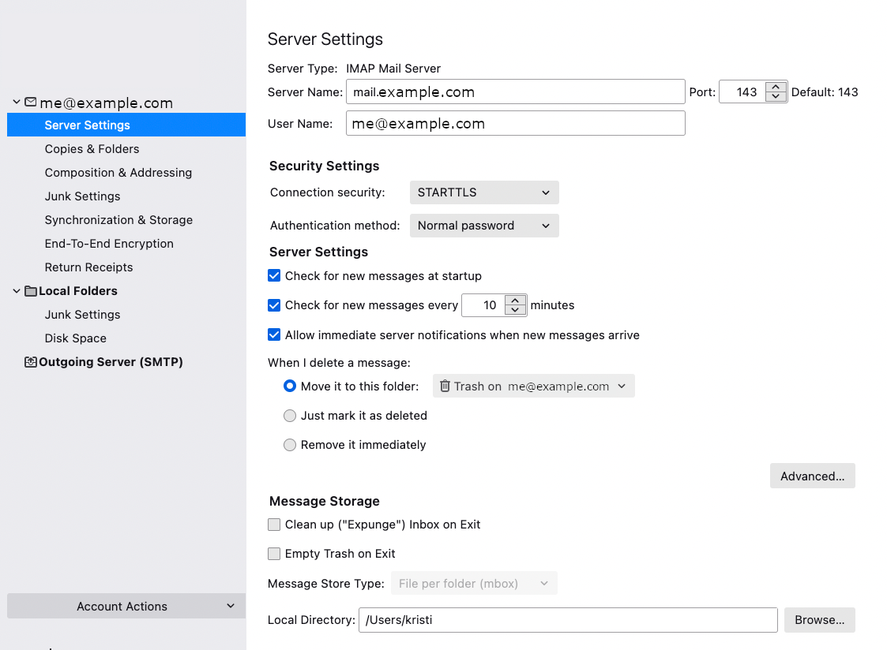
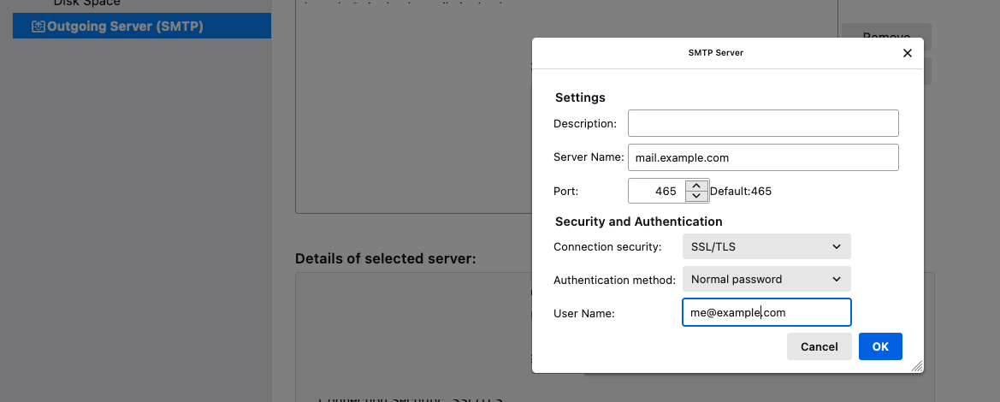

# How to connect with Thunderbird

This guide shows how to connect Thunderbird to your docker-mailserver instance.

The same settings apply to most desktop mail clients.

## Recommended settings

| Setting         | Value                                 |
| --------------- | ------------------------------------- |
| Incoming (IMAP) | **993** with SSL/TLS (IMAPS)          |
| Outgoing (SMTP) | **587** with STARTTLS (submission)    |
| Username        | Full email address (`me@example.com`) |
| Authentication  | Normal password                       |

Plain IMAP on port **143** is disabled by default (`expose_imap_plain: false` in `configs/vars/vars.yml`).
Enable it only if you need legacy clients on a trusted network.

## Steps

1. Right-click on the left sidebar, then choose **Settings**.

1. Add the new account (for example `me@example.com`).

Use **IMAP server** `mail.example.com`, port **993**, connection security **SSL/TLS**.

1. Add the outgoing SMTP server.

Use SMTP server `mail.example.com`, port **587**, connection security **STARTTLS**, authentication **Normal password**.

That is all. Thunderbird will prompt for the mailbox password from `configs/vars/vault.yml`.
